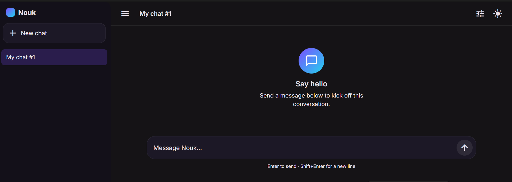
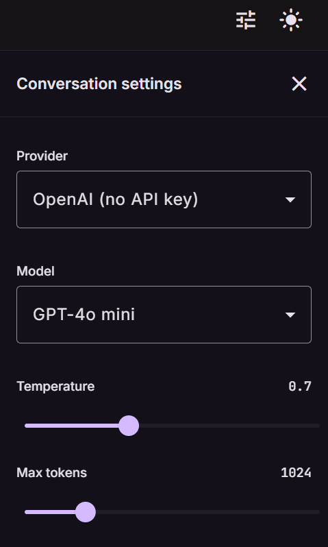

# Nouk — AI Chat App

A polished, provider-agnostic AI chat interface built in Angular + Node engineering: a distinctive Material 3 UI, real SSE streaming from three different AI vendors behind a single abstraction, and a full test suite (unit + integration + E2E) wired into CI.

This is a **portfolio project**, not a production SaaS — the scope is deliberately bounded (see [Future improvements](#future-improvements)) so the code that *does* exist can be reviewed carefully rather than skimmed.

## Screenshots

| Chat view | Conversation settings |
| --- | --- |
|  |  |

## Features

- **Conversations** — create, rename (inline from the header or sidebar), delete (with a confirmation dialog, not a native `confirm()`)
- **Streaming responses** over Server-Sent Events, with a working **stop generation** button that aborts the in-flight request server-side
- **Regenerate** the last assistant response
- **Edit a previous user message** — reruns the conversation from that point, discarding everything after it
- **Copy message** to clipboard
- **Markdown rendering** — fenced code blocks with syntax highlighting, tables, lists, inline code, blockquotes
- **"Thinking" indicator** while waiting for the first streamed token
- Message **timestamps** and an approximate, clearly-labelled **token count**
- Per-conversation **settings**: provider, model, temperature, max tokens, and system prompt — all persisted
- Fully **responsive** (desktop / tablet / mobile) with a collapsible sidebar
- Designed **loading skeletons**, **empty states**, and **error states** — no default browser alerts
- **Dark / light theme** toggle, persisted locally

## Technologies used

**Frontend**
- Angular 20 (standalone components, no `NgModule`s), TypeScript strict mode
- Angular Material 3 + custom SCSS theming (`light-dark()`-driven, not the default look)
- Angular Signals for state, RxJS where it earns its keep (SSE streaming, debounced saves)
- `marked` + a trimmed `highlight.js` bundle for markdown/code rendering
- Karma + Jasmine for unit tests

**Backend**
- Node.js 22 + Express, TypeScript
- `openai`, `@anthropic-ai/sdk`, `@google/generative-ai` SDKs behind a single `AiProvider` interface
- Server-Sent Events for streaming, an in-memory repository-pattern data layer
- Node's built-in `node:test` runner for unit + integration tests (no extra test framework dependency)

**Tooling / CI**
- ESLint + Prettier (frontend), TypeScript strict mode (both)
- Playwright for end-to-end tests
- GitHub Actions running lint, unit tests, E2E tests, and production builds on every push

## Architecture

```
nouk-ai-chat-app/
  backend/     Express + TypeScript API (SSE streaming, in-memory repository)
  frontend/    Angular 20 standalone app
  e2e/         Playwright end-to-end tests against both servers
```

### Folder structure

**`frontend/src/app`**

```
core/        singleton services (state store, API client, SSE client, theme, toasts)
shared/      reusable dumb components, pipes, directives (markdown renderer, dialogs, skeletons)
features/
  chat/      the chat feature — lazy-loaded, owns its own routes and services
layout/      shell, sidebar, header
models/      shared TypeScript interfaces
```

**`backend/src`**

```
ai-providers/   AiProvider interface + OpenAI/Anthropic/Gemini implementations + factory
chat/           SSE route handler
conversations/  repository-pattern in-memory store + service
middleware/     async error handling, centralized error responses
types/          shared request/response shapes
```

**`e2e/tests`** — Playwright specs grouped by user flow (conversation management, settings/theme persistence, error handling, responsive layout), plus a small `helpers.ts` for shared setup.

### Architectural decisions

- **A single `AiProvider` interface, one adapter per vendor.** `streamCompletion(messages, options): AsyncIterable<string>` is the entire contract. The frontend never sees a vendor name beyond a `provider` string it sends in the request body — swapping or adding a vendor means writing one new adapter class and registering it in the factory, nothing else changes.
- **Repository pattern for storage, even though it's in-memory today.** `ConversationRepository` is a small interface around a `Map`, specifically so a real database could be substituted later without touching the service layer above it. Per this project's scope, no database was added — the abstraction is there for the *next* step, not because it's needed today.
- **SSE-over-POST, not `EventSource`.** A native `EventSource` can't send a request body, so streaming is implemented as a hand-rolled `fetch` + `ReadableStream` reader that parses `event:`/`data:` frames. This is also what makes "stop generation" simple: the client `Observable`'s teardown function just aborts the fetch's `AbortSignal`.
- **Silent resync after every stream.** The client optimistically renders the user's message and streams tokens locally, but once a stream ends (success, stop, or error) the frontend does one quiet `GET /conversations/:id` to resync with the server's canonical state. This is what makes "edit a previous message" reliably target the right message id, without needing the server to echo ids back through the SSE channel.
- **Missing API keys fail before the stream opens.** `isConfigured()` is checked up front and surfaced as a normal `422` JSON error, rather than opening an SSE connection and failing mid-stream — simpler error handling on the client, and the server never has to unwind a half-open stream.
- **No state-management library.** `ConversationStore` and `ChatFacade` are plain injectable services holding `signal()`s. The state graph is small and doesn't have the cross-cutting complexity that would justify NgRx/Elf-style infrastructure.
- **`node:test` instead of Jest/Vitest for the backend.** Node 22 ships a real test runner with coverage support built in; adding a third-party framework would be pure overhead for this project's size.

## Setup

### Prerequisites

- Node.js 22.12+ (the frontend build tooling requires this)
- API keys for whichever AI provider(s) you want to actually use — the app runs and is fully navigable with zero keys configured, but sending a message will surface a clear "missing API key" error for an unconfigured provider

### 1. Backend

```bash
cd backend
cp .env.example .env
# edit .env and add whichever of OPENAI_API_KEY / ANTHROPIC_API_KEY / GEMINI_API_KEY you have
npm install
npm run dev
```

The API listens on `http://localhost:3000`.

### 2. Frontend

```bash
cd frontend
npm install
npm start
```

The app is served at `http://localhost:4200` and talks to the backend at `http://localhost:3000/api` (see `frontend/src/app/core/config/api.config.ts` if you need to point it elsewhere).

## Testing

Every service, guard/interceptor pattern, and reusable utility has unit test coverage; critical user flows are covered end-to-end.

### Backend — unit + integration tests

```bash
cd backend
npm test              # run once
npm run test:coverage # with a coverage report
```

Covers the `AiProviderFactory`, `ConversationService`, the in-memory repository, middleware, and — as an integration test — the full SSE `/api/chat` route (send/regenerate/edit/stop/error paths) with a fake provider swapped into the real `AiProviderFactory` singleton, so everything except the actual vendor network call runs exactly as shipped. **97.96%** line coverage.

### Frontend — unit tests

```bash
cd frontend
npm test                    # watch mode
npx ng test --watch=false   # single run, as CI runs it
```

Covers every service and utility: `ConversationStore`, `ChatFacade`, `ChatStreamService` (SSE parsing, abort-on-unsubscribe), `ConversationApiService`, `ThemeService`, `ToastService`, `ChatUiStateService`, and the markdown renderer / token-estimate utilities. **91.59%** statement coverage.

### End-to-end — Playwright

```bash
cd e2e
npm install
npx playwright install --with-deps chromium
npm test
```

Boots real backend + frontend dev servers and drives a real browser through conversation management, settings persistence, theme persistence, responsive layout, and the graceful "missing API key" error path (skipped automatically if a real key happens to be configured in that environment).

### CI

`.github/workflows/ci.yml` runs on every push/PR: backend typecheck + test + build, frontend lint + format check + unit tests + build, then Playwright E2E against fresh server instances. The Playwright HTML report is uploaded as an artifact on failure.

## Future improvements

Intentionally not built yet, to keep this a focused portfolio piece rather than a growing SaaS — listed here as the natural next steps rather than gaps:

- **Authentication / user accounts** — the in-memory store is single-tenant by design; this is the natural next step before the app could serve multiple real users
- **A persistent database** — the repository-pattern abstraction (`ConversationRepository`) exists specifically so a Postgres/SQLite implementation could be dropped in later without touching the service layer
- **Folders, pinning, archiving** — would want a real database first, so organization isn't lost on restart
- **File/image attachments** — meaningfully changes the message model and provider request shape; a deliberate v2 scope
- **Analytics/dashboards, global search, a command palette** — not core to demonstrating the chat experience itself
